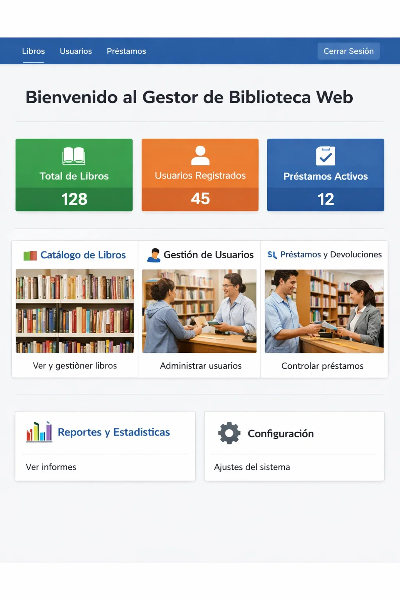

# 🧭 Uso

## 👥 Usuarios tipo
- *Bibliotecario*
- *Usuario lector*

## 📌 Casos de uso
- Consultar libros
- Gestionar préstamos
- Visualizar información

## Captura de pantalla


## 💻 Código en línea
El sistema se inicia con el comando `npm start`.

## 🧾 Bloque de código

```bash
sudo apt update
sudo apt install apache2 -y
```
